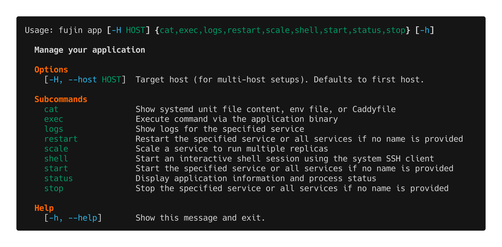

app
===

The ``fujin app`` command provides tools to manage your running application services.

.. note::
   The ``fj`` command is available as a convenient shortcut for ``fujin app``.
   For example, ``fj status`` is equivalent to ``fujin app status``.

Overview
--------

Use ``fujin app`` (or the shorter ``fj``) to control your application's systemd services:

- Start, stop, and restart services
- View real-time logs
- Inspect service status
- Access systemd unit configurations
- View deployment history

The app command works with service names from your ``.fujin/systemd/`` directory and intelligently handles related units (sockets, timers).

Usage Examples
--------------

Given the following systemd units in ``.fujin/systemd/``:

.. code-block:: text

    .fujin/systemd/
    ├── web.service       # Web server with socket activation
    ├── web.socket        # Socket for web service
    ├── worker.service    # Background worker
    └── worker.timer      # Timer for worker (hourly)

You can interact with services in various ways (examples show both ``fujin app`` and the ``fj`` shortcut):

**Manage all services**

.. code-block:: bash

    # Start/Stop/Restart all services (web, worker, socket, timer)
    fj start
    fj stop
    fj restart

**Manage specific process groups**

When targeting a process by name, it includes related units (sockets, timers).

.. code-block:: bash

    # Starts web.service AND web.socket
    fj start web

    # Logs for worker.service AND worker.timer
    fj logs worker

**Manage specific systemd units**

You can be specific by appending the unit type.

.. code-block:: bash

    # Only restart the service, not the socket
    fj restart web.service

    # Only show logs for the timer
    fj logs worker.timer

    # Only stop the socket
    fj stop web.socket

Logs Command
------------

The ``logs`` command is one of the most frequently used app subcommands. It provides various options for viewing application logs.

**Basic usage**

.. code-block:: bash

   # Show logs for all services
   fj logs

   # Show logs for specific process
   fj logs web

   # Show logs for specific unit
   fj logs web.service

**Follow logs in real-time**

.. code-block:: bash

   # Follow logs (like tail -f)
   fj logs -f

   # Follow logs for specific process
   fj logs -f web

**Control log output**

.. code-block:: bash

   # Show last 100 lines (default: 50)
   fujin app logs -n 100

   # Show last 200 lines and follow
   fujin app logs -n 200 -f

   # Show all available logs
   fujin app logs -n 0

**Logs for specific timeframes**

.. code-block:: bash

   # Logs since last hour
   fujin app logs --since "1 hour ago"

   # Logs since specific time
   fujin app logs --since "2024-12-28 14:30:00"

   # Logs from the last day
   fujin app logs --since yesterday

**Log filtering and inspection**

.. code-block:: bash

   # Show only errors (pipe through grep)
   fujin app logs | grep ERROR

   # Follow logs and filter for specific pattern
   fujin app logs -f web | grep "Request processed"

Info Command
------------

Display application information and process status overview.

.. code-block:: bash

   fujin app info

The info command displays:

- Application name and directory
- Local version (from your project)
- Remote version (currently deployed)
- Available rollback targets
- Python version (for python-package mode)
- Running URL (if webserver enabled)
- Status table showing all processes (active/inactive/failed)

Start, Stop, Restart Commands
------------------------------

**Start services**

.. code-block:: bash

   # Start all services
   fujin app start

   # Start specific process (includes socket/timer)
   fujin app start web

   # Start only the service unit
   fujin app start web.service

**Stop services**

.. code-block:: bash

   # Stop all services
   fujin app stop

   # Stop specific process
   fujin app stop worker

   # Stop only the timer
   fujin app stop worker.timer

**Restart services**

.. code-block:: bash

   # Restart all services (useful after config changes)
   fujin app restart

   # Restart specific process
   fujin app restart web

   # Restart to reload environment variables
   fujin app restart

Shell Command
-------------

Open an interactive shell on the server in your app's directory.

.. code-block:: bash

   # Open bash shell in app directory
   fujin app shell

.. important::

   **Runs as app user**: The shell runs as the app user (e.g., ``bookstore``), not the deploy user. This gives you write access to app-owned files like databases, logs, and uploads.

   This is equivalent to: ``fujin exec --appenv bash``

   **App binary wrapper**: Inside the shell, the app binary command (e.g., ``bookstore``) is automatically wrapped to run as the app user. This means you can simply type:

   .. code-block:: bash

      bookstore@server:/opt/fujin/bookstore$ bookstore createsuperuser
      bookstore@server:/opt/fujin/bookstore$ bookstore migrate

   The wrapper function in ``.appenv`` ensures these commands have the correct permissions without needing ``sudo`` manually.

This is useful for:

- Inspecting deployed files
- Running one-off commands with database write access
- Debugging deployment issues
- Checking file permissions
- Testing commands before creating aliases

Cat Command
-----------

Display systemd unit file contents for your services.

.. code-block:: bash

   # Show unit file for web service
   fujin app cat web

   # Show unit file for specific unit type
   fujin app cat web.service

   # Show all units
   fujin app cat units

   # Show Caddy configuration
   fujin app cat caddy

Common Workflows
----------------

**After deployment, check everything is running**

.. code-block:: bash

   fujin app info
   fujin app logs -n 20

**Debug a failing service**

.. code-block:: bash

   # Check status
   fujin app info web

   # View recent logs
   fujin app logs web -n 100

   # Follow logs while restarting
   fujin app restart web

**Monitor production application**

.. code-block:: bash

   # Follow all logs
   fujin app logs -f

   # Follow only web service logs
   fujin app logs -f web

**After changing environment variables**

.. code-block:: bash

   # Restart to pick up new .env
   fujin app restart

   # Verify the change took effect
   fujin app logs -n 10

**Investigate high memory usage**

.. code-block:: bash

   # Check current status
   fujin app info

   # View logs for memory-related messages
   fujin app logs | grep -i "memory\|oom"

   # Access shell to investigate further
   fujin app shell

**Run database operations interactively**

.. code-block:: bash

   # Open shell as app user (can write to database)
   fujin app shell

   # Now in the shell:
   bookstore@server:/opt/fujin/bookstore$ python manage.py createsuperuser
   bookstore@server:/opt/fujin/bookstore$ python manage.py migrate
   bookstore@server:/opt/fujin/bookstore$ sqlite3 db.sqlite3 ".tables"

.. tip::

   The ``fujin app shell`` command runs as the app user, giving you the same permissions as your running services. This means you can safely modify databases and write to logs without permission errors.
