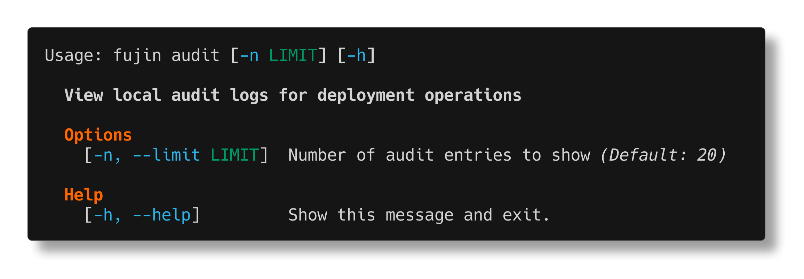

audit
=====

The ``fujin audit`` command displays a local audit log of all deployment operations. It helps track what was deployed, when, and by whom.

Overview
--------

Fujin automatically logs every deployment operation to a local audit file. The audit command provides a formatted view of this log, making it easy to:

- Track deployment history
- Debug deployment issues
- Understand what changed between deployments
- Maintain compliance and accountability

The audit log is stored locally in your project directory at ``.fujin/audit.log`` and travels with your codebase.

Usage
-----

.. code-block:: bash

   fujin audit [OPTIONS]

Options
-------

``-H, --host HOST``
   Filter audit logs for a specific host in multi-host setups.

``--limit N``
   Show only the last N operations. Default: 20.

What Gets Logged
----------------

Fujin logs the following operations:

- **deploy** - Application deployments
- **rollback** - Rollback to previous version
- **down** - Teardown operations
- **up** - Initial server provisioning and deployment

Each log entry includes:

- **Timestamp** - When the operation occurred
- **Operation** - What was done (deploy, rollback, etc.)
- **Host** - Which server was targeted
- **Version** - Application version deployed
- **User** - Who triggered the operation
- **Status** - Success or failure

Examples
--------

**View recent deployment history**

.. code-block:: bash

   fujin audit

**View last 5 operations**

.. code-block:: bash

   fujin audit --limit 5

**Filter by host**

.. code-block:: bash

   fujin audit -H production

**View all operations**

.. code-block:: bash

   fujin audit --limit 0

Common Use Cases
----------------

.. admonition:: Track production deployments

   Quickly see what version is deployed and when:

   .. code-block:: bash

      fujin audit -H production --limit 10

.. admonition:: Debugging deployment issues

   If a deployment failed, check the audit log to see:

   - When the last successful deployment was
   - What version is currently deployed
   - If there were recent rollbacks

.. admonition:: Compliance and accountability

   The audit log provides a record of all deployment activities, useful for:

   - Compliance requirements
   - Change management
   - Post-incident analysis

.. admonition:: Multi-environment tracking

   In multi-host setups, track which environments have which versions:

   .. code-block:: bash

      fujin audit -H staging --limit 1
      fujin audit -H production --limit 1

Understanding the Audit Log
----------------------------

**Timestamp format**

Displayed in your local timezone for convenience.

**Operation types**

- ``deploy`` - Normal deployment
- ``up`` - First-time server setup + deployment
- ``rollback`` - Reverted to previous version
- ``down`` - Application teardown

**Host names**

In multi-host configurations, shows which host was targeted. For single-host setups, may show "default" or the host's domain name.

**Version tracking**

Shows the application version that was deployed or rolled back to.

**User information**

The system username of the person who ran the command.

Audit Log File
--------------

**Location**

The audit log is stored at ``.fujin/audit.log`` in your project root.

**Format**

JSON Lines format (JSONL) - one JSON object per line, making it easy to parse programmatically:

.. code-block:: json

   {"timestamp": "2024-12-28T14:30:00", "operation": "deploy", "host": "production", "version": "1.2.3", "user": "tobi"}

**Backup and rotation**

The audit log file is not automatically rotated. Consider backing it up periodically or adding it to your version control (recommended).

**Version control**

We recommend committing ``.fujin/audit.log`` to version control so the deployment history is shared across your team.

**Programmatic access**

Since it's JSONL format, you can easily process it with tools like ``jq``:

.. code-block:: bash

   # Count deployments per host
   cat .fujin/audit.log | jq -s 'group_by(.host) | map({host: .[0].host, count: length})'

   # Find all failed deployments
   cat .fujin/audit.log | jq 'select(.status == "failed")'

Troubleshooting
---------------

**"No audit logs found"**

You haven't made any deployments yet with audit logging enabled (it's a recent feature). Future operations will be logged.

**Audit log is empty after deployment**

The audit logging might have failed. Check:

- You have write permissions in the ``.fujin/`` directory
- The directory exists (``mkdir -p .fujin``)

**Missing recent deployments**

If you deployed from a different directory or different clone of the repository, the audit logs won't be synchronized (they're local). Consider:

- Committing ``.fujin/audit.log`` to version control
- Using a centralized logging system for production deployments

See Also
--------

- :doc:`deploy` - Deploy command
- :doc:`rollback` - Rollback command
- :doc:`app` - Application management

.. note::

   Audit logging was added in version 0.14.0. Earlier deployments won't appear in the audit log.
