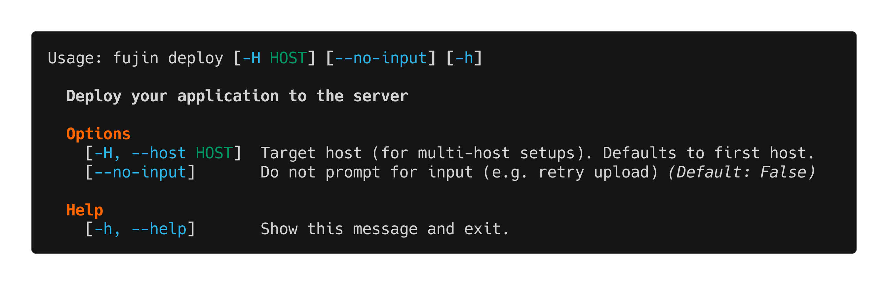

deploy
======

The ``fujin deploy`` command deploys your application to the server.

Overview
--------

This is the core deployment command. It builds your application locally, bundles all necessary files, uploads them to the server, and installs/configures everything.

Use ``fujin deploy`` for:

- Deploying code changes
- Updating configuration
- Updating environment variables
- Refreshing systemd units or Caddy configuration

How it works
------------

Here's a high-level overview of what happens when you run the ``deploy`` command:

1. **Resolve secrets**: If you have defined a ``secrets`` configuration, it will be used to retrieve pull the ``secrets`` defined in your ``envfile``.

2. **Build the Application**: Your application is built using the ``build_command`` specified in your configuration.

3. **Bundle Artifacts**: All deployment assets are staged locally into a single tarball (``deploy.tar.gz``). The bundle contains your dist file, optional ``requirements.txt``, the rendered ``.env``, generated systemd unit files, the Caddyfile (when enabled), and install/uninstall scripts. A checksum is calculated for integrity verification.

4. **Upload Once**: The bundle is uploaded to the host under ``{app_dir}/.versions/`` and its checksum is verified remotely. Retries are offered on mismatch.

5. **Install from Bundle**: The bundle is extracted on the host and ``install.sh`` installs the project: Python mode creates/uses the virtualenv and installs dependencies; binary mode copies the binary into place.

6. **Configure and Start Services**: Generated ``systemd`` unit files are installed (stale ones are cleaned up), services are enabled and restarted, and the Caddy configuration is applied/reloaded when enabled.  

7. **Prune Old Bundles**: Old bundles are removed from ``.versions`` according to ``versions_to_keep``.

8. **Completion**: A success message is displayed, and the URL to access the deployed project is provided.

Deployment Layout and Permissions
----------------------------------

All applications are deployed to ``/opt/fujin/{app_name}`` with a secure permission model that separates deployment and runtime privileges.

Directory Structure
~~~~~~~~~~~~~~~~~~~

.. tab-set::

    .. tab-item:: python package

        .. code-block:: shell

            /opt/fujin/{app_name}/
            ├── .env                              # Environment variables file (640)
            ├── .appenv                           # Application-specific environment setup
            ├── .version                          # Current deployed version
            ├── .venv/                            # Virtual environment (Python from shared dir)
            └── .versions/                        # Stored deployment bundles
                ├── app-1.2.3.pyz
                └── app-1.2.2.pyz

    .. tab-item:: binary

        .. code-block:: shell

            /opt/fujin/{app_name}/
            ├── .env                              # Environment variables file (640)
            ├── .appenv                           # Application-specific environment setup
            ├── .version                          # Current deployed version
            ├── app_binary                        # Installed binary (755)
            └── .versions/                        # Stored deployment bundles
                ├── app-1.2.3.pyz
                └── app-1.2.2.pyz

Shared Python Directory
~~~~~~~~~~~~~~~~~~~~~~~~

Python versions are installed in a shared directory accessible to all applications:

.. code-block:: shell

    /opt/fujin/.python/
    └── cpython-3.13.11-linux-x86_64-gnu/
        └── bin/python3.13

This shared location (configured via ``UV_PYTHON_INSTALL_DIR``) allows:

- Multiple applications to share Python installations
- Systemd services to use ``ProtectHome=true`` security directive
- Deploy users to change without breaking existing deployments

Permission Model
~~~~~~~~~~~~~~~~

Fujin uses a multi-user security model with three components:

1. **fujin group** (``root:fujin``): Members can deploy applications

   - Created during ``fujin server bootstrap``
   - Deploy users are added to this group
   - Grants write access to ``/opt/fujin/``

2. **Deploy user** (e.g., ``tobi``): Owns application files

   - Member of ``fujin`` group
   - Can deploy and manage applications
   - Owns ``.venv``, code, configuration files

3. **App user** (e.g., ``bookstore``): Runs services

   - Non-privileged user created per-application
   - Cannot modify application code or ``.venv``
   - Can write to database files and logs within app directory
   - Used automatically for ``fujin exec --appenv`` and ``fujin app`` commands

.. note::

   **Running Commands as App User**

   When you use ``fujin exec --appenv`` or ``fujin app exec``, commands automatically run as the app user (not the deploy user). This ensures commands can write to app-owned files like databases, logs, and uploads.

   For example, Django's ``createsuperuser`` command needs to write to ``db.sqlite3`` (owned by ``bookstore:bookstore``). Running it as the deploy user would fail with permission errors. Fujin handles this automatically:

   .. code-block:: bash

      # These commands run as the app user
      fujin app shell                    # Opens shell as 'bookstore'
      fujin exec --appenv python         # Runs Python as 'bookstore'
      fujin exec --app migrate           # Runs Django migration as 'bookstore'

      # Plain server commands still run as deploy user
      fujin exec ls -la                  # Runs as 'tobi' (deploy user)

   **Inside the shell**: The ``.appenv`` file contains a wrapper function that automatically runs the app binary (e.g., ``bookstore``) as the app user. This means when you're in ``fujin app shell``, you can simply type ``bookstore migrate`` and it will work correctly without manual ``sudo``.

Example permissions:

.. code-block:: shell

    /opt/fujin/                      root:fujin       drwxrwxr-x (775)
      ├── .python/                   root:fujin       drwxrwxr-x (775)
      └── bookstore/                 tobi:bookstore   drwxrwxr-x (775)
          ├── .env                   tobi:bookstore   -rw-r----- (640)
          ├── .venv/                 tobi:bookstore   drwxr-xr-x (755)
          └── db.sqlite3             bookstore:...    -rw-r--r-- (664)

Security Benefits
~~~~~~~~~~~~~~~~~

This model provides defense-in-depth:

- **Process isolation**: Services run as non-root app user
- **Code protection**: App user cannot modify source code or ``.venv``
- **Database access**: App user can read/write database files
- **Home directory isolation**: Systemd ``ProtectHome=true`` prevents access to ``/home``
- **System protection**: Systemd ``ProtectSystem=strict`` makes most of filesystem read-only
- **Multi-user support**: Any member of ``fujin`` group can deploy

If an application is compromised, the attacker:

- ✗ Cannot modify application code
- ✗ Cannot access other users' home directories
- ✗ Cannot access other applications' directories (no read/write permissions)
- ✓ Can only read/write within the app directory with group permissions

Migrating Existing Deployments
~~~~~~~~~~~~~~~~~~~~~~~~~~~~~~~

If you have applications deployed before the shared Python directory feature was added, you need to migrate them to use the new security model.

**Symptoms of unmigrated deployments:**

- Services fail with exit code 203/EXEC
- Python installed in ``~/.local/share/uv/python``
- Systemd units using ``ProtectHome=read-only`` (old insecure setting)

**Migration steps:**

1. **Update systemd service files** in ``.fujin/systemd/*.service``:

   .. code-block:: ini

      # Change from:
      ProtectHome=read-only
      ReadWritePaths={app_dir}/.venv

      # To:
      ProtectHome=true
      ReadWritePaths={app_dir}

2. **Run bootstrap** to create shared Python directory:

   .. code-block:: bash

      fujin server bootstrap

   This creates ``/opt/fujin/.python`` with proper permissions.

3. **Redeploy your application**:

   .. code-block:: bash

      fujin deploy

   The installer will automatically:

   - Install Python to ``/opt/fujin/.python``
   - Recreate the venv pointing to the shared Python
   - Apply the updated systemd units with ``ProtectHome=true``

**Verification:**

After redeployment, verify the migration:

.. code-block:: bash

   # Check Python location
   ssh user@host "readlink /opt/fujin/myapp/.venv/bin/python"
   # Should show: /opt/fujin/.python/cpython-3.x.x-.../bin/python3.x

   # Verify systemd security
   ssh user@host "systemd-analyze security myapp-web.service | grep ProtectHome"
   # Should show: ✓ ProtectHome=true

   # Check services are running
   fujin app status

**Notes:**

- Old Python installations in ``~/.local/share/uv/python`` are not automatically removed
- They can be manually deleted to free disk space
- Multiple applications share the same Python installation in ``/opt/fujin/.python``
- If you have multiple apps, redeploy each one to migrate them all
