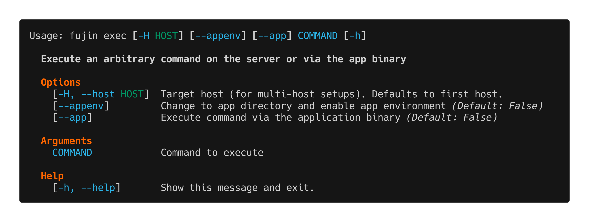

exec
====

The ``fujin exec`` command executes arbitrary commands on your server, either through the application binary or directly on the server with the app environment loaded.

Overview
--------

``fujin exec`` provides a flexible way to run commands in your deployment environment:

- Run Django/Flask management commands
- Execute database queries
- Run maintenance scripts
- Debug issues in production
- Test configurations

The command intelligently determines where to execute based on your installation mode:

- **Python package mode**: Runs commands via the installed application binary
- **Binary mode**: Executes commands on the server with app environment loaded

Usage
-----

.. code-block:: bash

   fujin exec [OPTIONS] COMMAND [ARGS...]

Options
-------

``-H, --host HOST``
   Target a specific host in multi-host setups. Defaults to the first host defined in your configuration.

``-i, --interactive``
   Run command in interactive mode (allocates a PTY). Required for commands that need user input.

``--appenv``
   Load application environment variables from ``.env`` file. Useful when running server commands that need access to app configuration.

Arguments
---------

``COMMAND [ARGS...]``
   The command to execute and its arguments. Everything after ``fujin exec [options]`` is passed to the remote command.

Execution Modes
---------------

**Python Package Mode (default)**

When your ``installation_mode`` is ``python-package``, commands are executed through your application binary:

.. code-block:: bash

   # Equivalent to running on server:
   # cd /path/to/app && .venv/bin/myapp migrate

   fujin exec migrate --no-input

**Binary Mode**

When your ``installation_mode`` is ``binary``, commands run as shell commands with working directory set to your app directory:

.. code-block:: bash

   # Runs in /path/to/app directory
   fujin exec ./myapp migrate

**With App Environment**

Use ``--appenv`` to load environment variables from your ``.env`` file:

.. code-block:: bash

   # Environment variables from .env are available
   fujin exec --appenv python script.py

Examples
--------

**Django management commands**

.. code-block:: bash

   # Run database migrations
   fujin exec migrate

   # Create superuser (interactive)
   fujin exec -i createsuperuser

   # Collect static files
   fujin exec collectstatic --no-input

   # Open Django shell
   fujin exec -i shell

   # If you have django-extensions
   fujin exec -i shell_plus

**Database operations**

.. code-block:: bash

   # Run database query
   fujin exec dbshell -i

   # Export database
   fujin exec --appenv pg_dump mydb > backup.sql

   # Show database size
   fujin exec 'python -c "from myapp import db; print(db.get_size())"'

**Flask commands**

.. code-block:: bash

   # Run Flask shell
   fujin exec -i flask shell

   # Run database migrations
   fujin exec flask db upgrade

   # Custom Flask command
   fujin exec flask my-custom-command

**Maintenance and debugging**

.. code-block:: bash

   # Check Python version
   fujin exec python --version

   # List installed packages
   fujin exec pip list

   # Check disk space
   fujin exec --appenv df -h

   # View environment variables
   fujin exec --appenv env

   # Run health check
   fujin exec healthcheck

**Server commands with app context**

.. code-block:: bash

   # Start a bash session in app directory
   fujin exec --appenv -i bash

   # Check running processes
   fujin exec --appenv ps aux | grep myapp

   # View log files
   fujin exec --appenv tail -f /var/log/myapp/error.log

**Multi-host operations**

.. code-block:: bash

   # Run migration on staging
   fujin exec -H staging migrate

   # Run migration on production
   fujin exec -H production migrate

Common Patterns
---------------

**Using aliases for frequent commands**

Instead of typing ``fujin exec -i shell`` repeatedly, create aliases in ``fujin.toml``:

.. code-block:: toml

   [aliases]
   shell = "exec -i shell"
   dbshell = "exec -i dbshell"
   migrate = "exec migrate"
   console = "exec -i shell_plus"

Then use:

.. code-block:: bash

   fujin shell        # Opens Django shell
   fujin migrate      # Runs migrations
   fujin console      # Opens shell_plus

**One-off scripts**

Run Python scripts in your app's environment:

.. code-block:: bash

   # Create a script
   echo 'from myapp.models import User; print(User.objects.count())' > count_users.py

   # Upload and run it
   scp count_users.py user@server:/path/to/app/
   fujin exec python count_users.py

**Data imports/exports**

.. code-block:: bash

   # Export data
   fujin exec dumpdata > data.json

   # Import data (after uploading file)
   fujin exec loaddata data.json

Interactive vs Non-Interactive
-------------------------------

**Non-interactive (default)**

For commands that don't need user input:

.. code-block:: bash

   fujin exec migrate
   fujin exec collectstatic --no-input
   fujin exec python script.py

**Interactive (-i flag)**

For commands that need user input or full terminal:

.. code-block:: bash

   fujin exec -i shell        # Django/Flask shell
   fujin exec -i bash         # Bash session
   fujin exec -i dbshell      # Database shell
   fujin exec -i createsuperuser

Common Use Cases
----------------

.. admonition:: Running migrations after deploy

   While you can use ``release_command`` for automatic migrations, sometimes you want to run them manually:

   .. code-block:: bash

      fujin exec migrate --plan    # Preview migrations
      fujin exec migrate           # Apply migrations

.. admonition:: Debugging production issues

   Investigate issues without redeploying:

   .. code-block:: bash

      fujin exec -i shell_plus
      >>> from myapp.models import Order
      >>> Order.objects.filter(status='pending').count()

.. admonition:: One-off administrative tasks

   .. code-block:: bash

      fujin exec createsuperuser -i
      fujin exec changepassword admin -i
      fujin exec clearsessions

.. admonition:: Testing before deployment

   Test commands on staging before production:

   .. code-block:: bash

      fujin exec -H staging migrate --plan
      # Review, then:
      fujin exec -H production migrate

Security Considerations
-----------------------

**Be careful with exec**

``fujin exec`` gives you full access to run commands on your server. Some precautions:

- Avoid running untrusted code
- Be careful with ``--appenv`` and environment variables
- Use ``-H`` flag explicitly for production commands
- Consider using :doc:`app` subcommands for common operations (they're safer)

**Environment variables**

Without ``--appenv``, environment variables from ``.env`` are NOT loaded. This is intentional for security.

**Interactive shells**

Interactive shells (``-i bash``) give you full server access. Use responsibly.

Troubleshooting
---------------

**Command not found**

Your application binary isn't in PATH. Check:

- Your ``installation_mode`` in ``fujin.toml``
- The binary was installed correctly during deployment
- The ``app_name`` matches your binary name

**Permission denied**

The command needs elevated permissions. Try:

- Using ``sudo`` in the command: ``fujin exec 'sudo command'``
- Ensuring your user has necessary permissions
- Checking file permissions in the app directory

**Interactive command hangs**

You forgot the ``-i`` flag for an interactive command:

.. code-block:: bash

   # Wrong - hangs
   fujin exec shell

   # Correct
   fujin exec -i shell

**Environment variables not available**

Add ``--appenv`` flag:

.. code-block:: bash

   fujin exec --appenv python script.py

See Also
--------

- :doc:`app` - Application management commands (safer alternatives)
- :doc:`../configuration` - Configuration reference
- :doc:`deploy` - Deployment workflow

.. tip::

   For frequently-used commands, create aliases in ``fujin.toml`` instead of typing ``fujin exec`` repeatedly. See the aliases section in the :doc:`../configuration` documentation.
