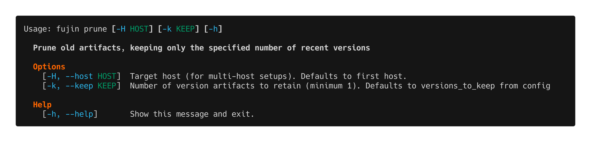

prune
=====

The ``fujin prune`` command removes old deployment artifacts, keeping only a specified number of recent versions.

Overview
--------

Over time, deployment bundles accumulate in ``~/apps/your-app/.versions/``. The prune command helps manage disk space by removing old versions while keeping recent ones for rollback.

**Automatic pruning:**
Fujin automatically prunes old versions after each deployment based on the ``versions_to_keep`` setting in your ``fujin.toml``.

**Manual pruning:**
Use ``fujin prune`` to manually clean up versions, useful when you want to:

- Free up disk space immediately
- Keep fewer versions than configured
- Clean up after testing multiple deployments

Usage
-----

.. code-block:: bash

   fujin prune [OPTIONS]

Options
-------

``-H, --host HOST``
   Target a specific host in multi-host setups.

``--keep N``
   Number of recent versions to keep. Overrides ``versions_to_keep`` from ``fujin.toml``.

Examples
--------

**Use configured value**

.. code-block:: bash

   fujin prune

**Keep specific number of versions**

.. code-block:: bash

   fujin prune --keep 3

**Keep only latest version**

.. code-block:: bash

   fujin prune --keep 1

Configuration
-------------

Set the default in ``fujin.toml``:

.. code-block:: toml

   versions_to_keep = 5  # Default: 5

Set to ``None`` to disable automatic pruning:

.. code-block:: toml

   versions_to_keep = None  # Never auto-prune

Common Scenarios
----------------

.. admonition:: Free up disk space

   If you're running low on disk space:

   .. code-block:: bash

      fujin prune --keep 2  # Keep only 2 recent versions

.. admonition:: After testing multiple deployments

   If you deployed many test versions:

   .. code-block:: bash

      fujin prune  # Clean up using configured value

.. admonition:: Before important deployment

   Ensure you have room for new deployment:

   .. code-block:: bash

      fujin prune
      fujin deploy

Disk Space Management
---------------------

**How much space do versions use?**

Each version bundle contains:

- Your application code (wheel/binary)
- Dependencies (if Python package)
- Environment file
- Systemd units
- Install scripts

Typical sizes:

- **Small app**: 5-20 MB per version
- **Medium app**: 50-100 MB per version
- **Large app with many dependencies**: 200-500 MB per version

**Check disk usage:**

.. code-block:: bash

   ssh user@server du -sh ~/apps/your-app/.versions/*

**Recommended settings:**

- **Development/staging**: ``versions_to_keep = 3-5``
- **Production**: ``versions_to_keep = 5-10`` (more rollback options)
- **Disk-constrained servers**: ``versions_to_keep = 2-3``

Safety
------

.. important::

   Pruning is safe - it doesn't affect your currently running application. It only removes old deployment bundles.

The prune command:

✅ Removes old bundles from ``.versions/``
✅ Keeps the current version
✅ Keeps N most recent versions
❌ Does NOT touch running services
❌ Does NOT modify current deployment

Troubleshooting
---------------

**"No versions found to prune"**

You have fewer versions than the keep threshold. This is normal.

**"Only X versions found. Nothing to prune (keep=Y)"**

Current version count is less than or equal to keep count. Nothing needs pruning.

**Prune doesn't free up expected space**

Check:

1. Other files in app directory (logs, databases, uploads):

   .. code-block:: bash

      ssh user@server du -sh ~/apps/your-app/*

2. Actual number of bundles:

   .. code-block:: bash

      ssh user@server ls ~/apps/your-app/.versions/

See Also
--------

- :doc:`deploy` - Automatic pruning after deployment
- :doc:`rollback` - Uses kept versions for rollback
- :doc:`../configuration` - Configure ``versions_to_keep``

.. tip::

   Balance between disk space and rollback safety. Production servers should keep more versions (5-10) while development can keep fewer (2-3).
