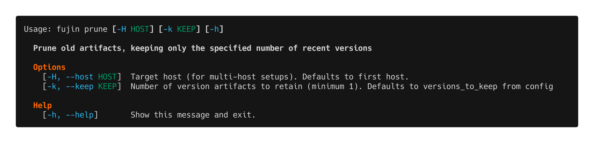

prune
=====

The ``fujin prune`` command removes old release directories, keeping only a specified number of recent versions.

Overview
--------

Over time, release directories accumulate in ``/opt/fujin/{app_name}/releases/``. Each release contains a full virtual environment (``.venv/``) and can be 50-200MB. The prune command helps manage disk space by removing old releases while keeping recent ones for rollback capability.

Fujin automatically prunes old releases after each deployment based on the ``versions_to_keep`` setting in your ``fujin.toml``. Use ``fujin prune`` to manually clean up releases when you need to free up disk space or keep fewer versions than configured.

Options
-------

``-k, --keep N``
   Number of recent versions to keep (minimum 1). Default: 2.

How it works
------------

Here's what happens when you run ``fujin prune``:

1. **Validate keep count**: Ensures ``--keep`` is at least 1.

2. **Check releases directory**: Verifies the ``releases/`` directory exists.

3. **List releases**: Lists all directories in the releases directory, sorted by modification time (newest first).

4. **Determine directories to delete**: If there are more releases than the keep count, selects the oldest releases for deletion.

5. **Prompt for confirmation**: Shows which versions will be deleted and asks for confirmation before proceeding.

6. **Delete old releases**: Removes the selected release directories.

The command is safe - it only removes old, inactive releases and doesn't affect your currently running application. The active release (pointed to by the ``current`` symlink) is never deleted.

See Also
--------

- :doc:`deploy` - Automatic pruning after deployment
- :doc:`rollback` - Uses kept versions for rollback
