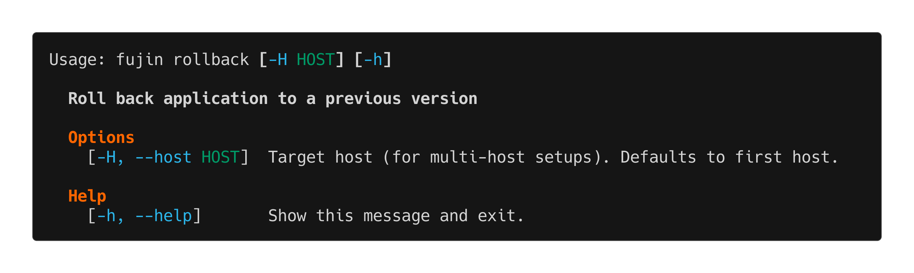

rollback
========

The ``fujin rollback`` command rolls back your application to a previous version.

Overview
--------

When a deployment goes wrong, ``fujin rollback`` quickly reverts to the last working version.

The command:

- Lists available versions
- Lets you select which version to roll back to
- Switches application to that version
- Restarts services
- Optionally cleans up newer versions

How it works:

Fujin keeps deployment bundles in ``~/apps/your-app/.versions/``. Each bundle contains everything needed to run that version. Rollback simply:

1. Extracts the selected bundle
2. Runs the install script
3. Restarts services

Usage
-----

.. code-block:: bash

   fujin rollback [OPTIONS] [VERSION]

Arguments
---------

``VERSION``
   Specific version to roll back to (optional). If not provided, you'll be prompted to select from available versions.

Options
-------

``-H, --host HOST``
   Target a specific host in multi-host setups.

``--clean``
   Remove versions newer than the rollback target. Useful to prevent accidentally deploying a broken version again.

Examples
--------

**Interactive rollback**

.. code-block:: bash

   fujin rollback

**Direct rollback to specific version**

.. code-block:: bash

   fujin rollback 1.2.2

**Rollback and clean up newer versions**

.. code-block:: bash

   fujin rollback 1.2.1 --clean

Common Scenarios
----------------

**Deployment failed or introduced bugs**

.. code-block:: bash

   # Quickly roll back to previous version
   fujin rollback

   # Select the last known good version

**Gradual rollout gone wrong**

If you deployed to staging, found issues, and want to prevent deploying to production:

.. code-block:: bash

   # Roll back staging
   fujin rollback -H staging

   # Fix the issues
   # Deploy again when ready

**Testing older version**

Roll back to test if a bug existed in a previous version:

.. code-block:: bash

   fujin rollback 1.1.0
   # Test...
   # Roll forward when done
   fujin rollback 1.2.3

Version Management
------------------

**Where versions are stored**

Deployment bundles are stored in: ``~/apps/your-app/.versions/``

.. code-block:: text

   .versions/
   ├── app-1.2.3.tar.gz  (current)
   ├── app-1.2.2.tar.gz
   ├── app-1.2.1.tar.gz
   └── app-1.2.0.tar.gz

**How many versions are kept**

Configure in ``fujin.toml``:

.. code-block:: toml

   versions_to_keep = 5  # Keep last 5 versions

Older versions are automatically pruned after deployment. See :doc:`prune` for manual cleanup.

**What gets rolled back**

- Application code
- Dependencies
- Environment variables (from deployment bundle)
- Systemd unit files

**What DOESN'T get rolled back**

- Database schema (you need to handle migrations)
- User-uploaded files
- External service configurations

Database Considerations
-----------------------

.. warning::

   Rollback doesn't automatically revert database migrations. If your new version included database migrations, you may need to manually revert them:

   .. code-block:: bash

      # After rollback
      fujin exec migrate --fake-initial  # Django example

   Or restore from database backup.

**Best practice:** Always backup your database before deploying schema changes.

Troubleshooting
---------------

**"No versions available for rollback"**

You haven't deployed multiple versions yet, or old versions were pruned. You need at least 2 versions to roll back.

**"Version X not found"**

The version bundle was manually deleted or doesn't exist. List available versions:

.. code-block:: bash

   fujin rollback  # Shows available versions

**Services fail to start after rollback**

The rolled-back version might have different dependencies or requirements. Check logs:

.. code-block:: bash

   fujin app logs

You may need to:

- Roll back database migrations
- Revert environment variable changes
- Check for missing dependencies

**"Current version same as rollback target"**

You're trying to roll back to the currently active version. This is a no-op.

Recovery Strategy
-----------------

If rollback itself fails:

1. **Check what went wrong:**

   .. code-block:: bash

      fujin app logs

2. **Try rolling back to an older stable version:**

   .. code-block:: bash

      fujin rollback <older-version>

3. **As last resort, redeploy a known good version:**

   .. code-block:: bash

      # Checkout good version in git
      git checkout v1.2.1
      # Deploy it
      fujin deploy

See Also
--------

- :doc:`deploy` - Deploy application
- :doc:`prune` - Manage old versions
- :doc:`audit` - View deployment history
- :doc:`app` - Check application status

.. tip::

   Always test deployments on staging before production. Keep enough old versions (``versions_to_keep = 5``) to have rollback options.
