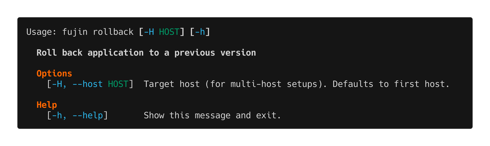

rollback
========

The ``fujin rollback`` command rolls back your application to a previous version.

Overview
--------

When a deployment goes wrong, ``fujin rollback`` quickly reverts to a previous version. The command is fully interactive - it lists all available versions from the ``releases/`` directory, prompts you to select which version to roll back to, and handles the complete rollback process.

Fujin stores each deployed version as a self-contained directory in ``/opt/fujin/{app_name}/releases/``. Each release contains the full virtual environment, application code, and configuration. A ``current`` symlink points to the active release — rolling back simply swaps this symlink and restarts services.

How it works
------------

Here's what happens when you run ``fujin rollback``:

1. **List available versions**: Scans the ``releases/`` directory and lists available versions in reverse chronological order (most recent first).

2. **Prompt for selection**: Asks you to select which version to roll back to, with the most recent version as the default.

3. **Confirm rollback**: Shows the current version and target version, and asks for confirmation before proceeding.

4. **Swap symlink**: Atomically updates the ``current`` symlink to point to the selected release directory.

5. **Restart services**: Reloads systemd and restarts all application services, which now pick up the new symlink target.

6. **Clean up newer releases**: Automatically deletes all releases newer than the selected target version to prevent accidentally re-deploying a broken version.

7. **Log operation**: Records the rollback operation to the audit log with from/to version information.

Below is an example of the releases directory structure:

.. code-block:: text

   /opt/fujin/{app_name}/releases/
   ├── 1.2.3/
   ├── 1.2.2/
   ├── 1.2.1/
   └── 1.2.0/

.. warning::

   Rollback does NOT automatically revert database migrations. If your deployment included schema changes, you'll need to handle database rollback separately - either restore from backup or manually reverse migrations using your framework's migration tools.

See Also
--------

- :doc:`deploy` - Deploy application
- :doc:`prune` - Manually manage old versions
- :doc:`audit` - View deployment history
